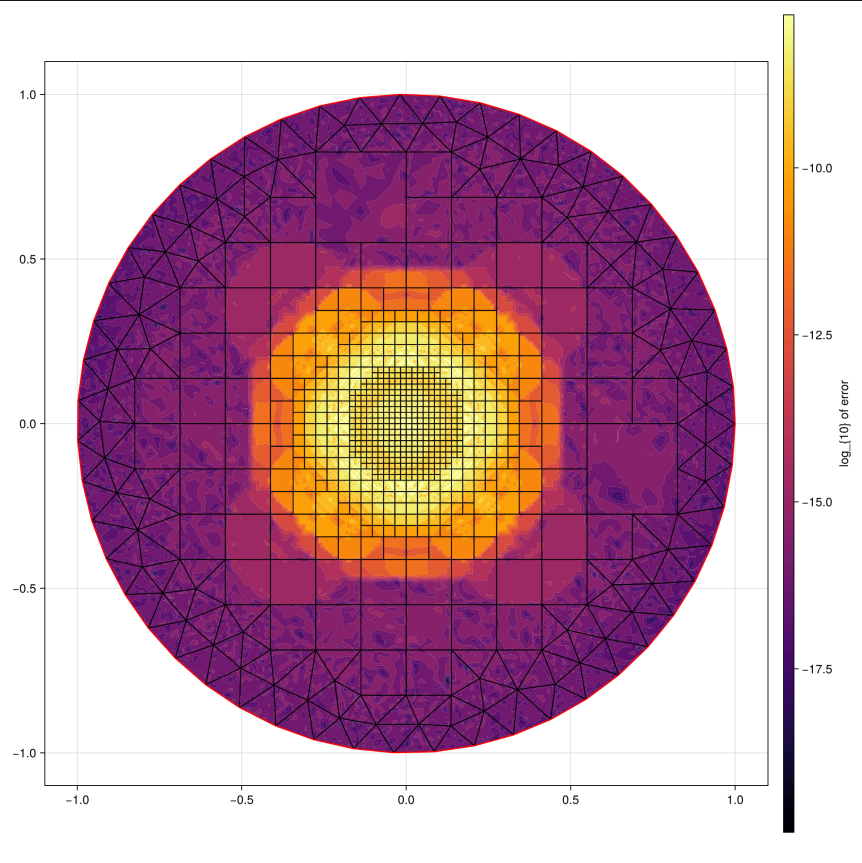

# Error Analysis

What ends up helping the error go down? considering the strong gaussian in the center (reducing any chance of triangle interaction)
- Increasing quad refinement levels
- Increasing quadrature order

However, even with high quadrature order, the error is still limited by the center. Consult the following image:

No matter what changes are made though, the center spike doesn't really go down in error. I'm inclined to think that this is floating point error.

Additional note: the circles on the graph above are somewhat related to the near-singular potential evaluation; as I reduce the radius of target points included in the near-singular potential evaluation, these circles shrink.